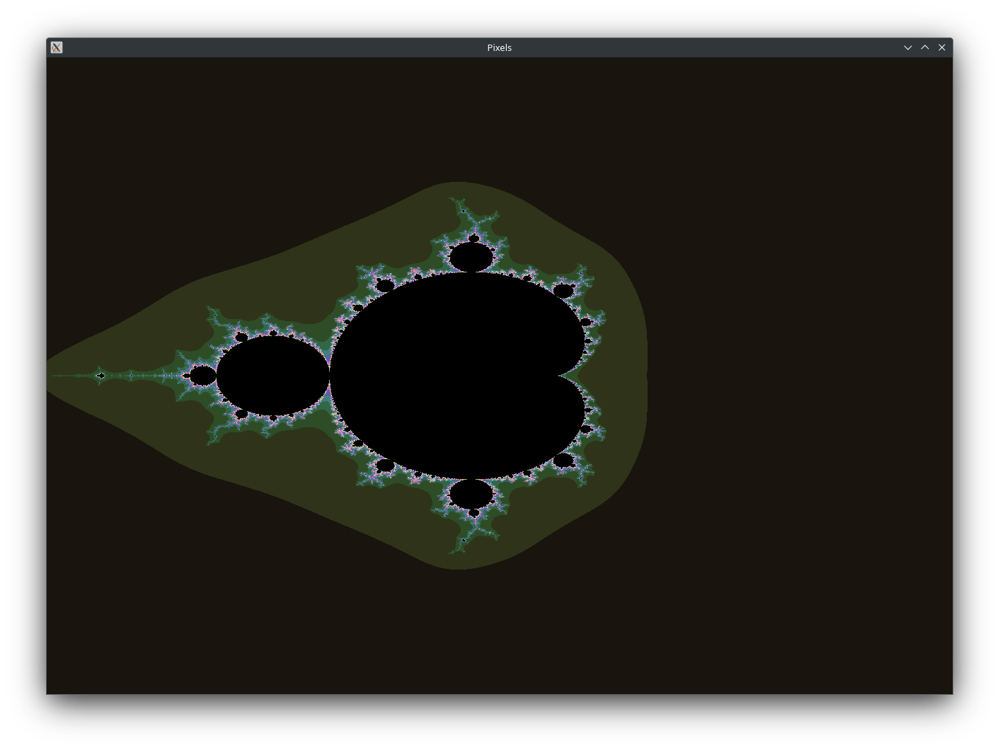
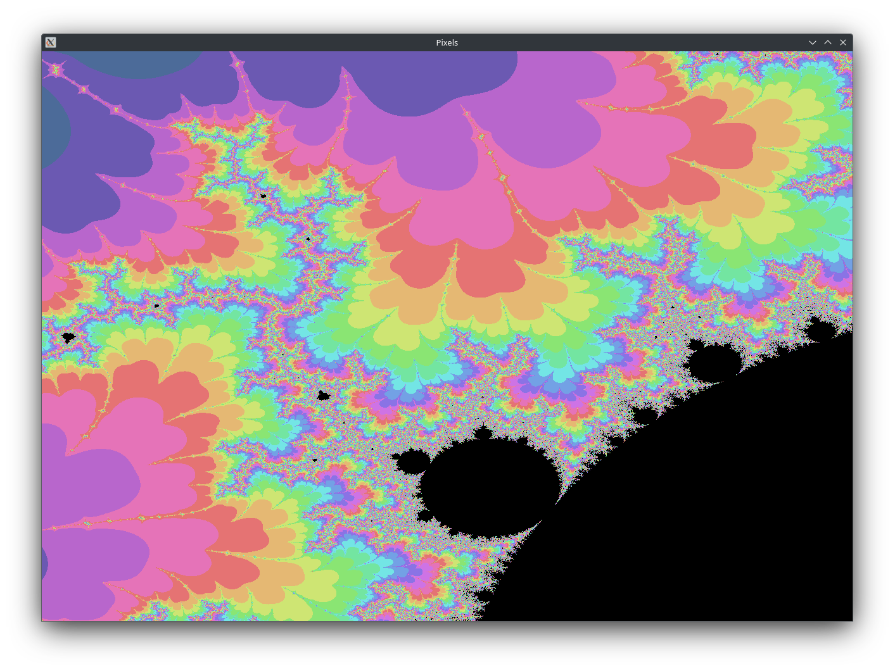
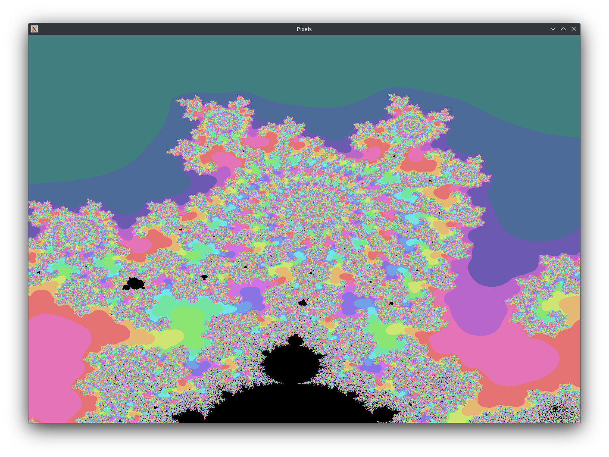
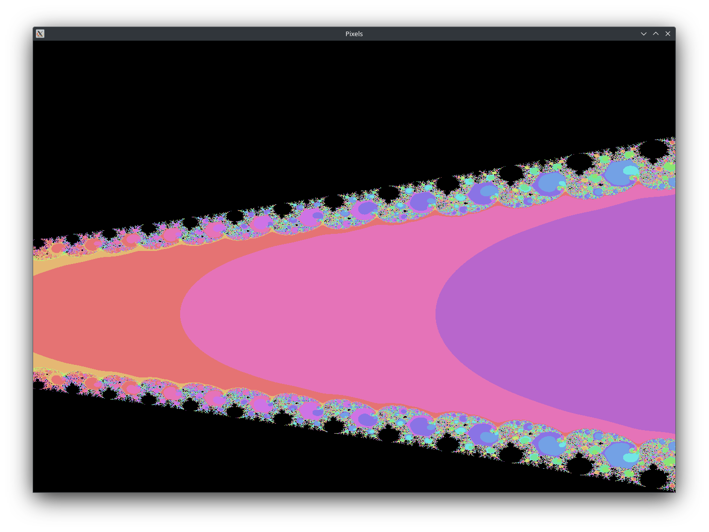

# Mandelbrot Viewer

A simple program written in C++ and OpenGL that renders the Mandelbrot Fractal. This is a rewrite of the older and slower [mandelbrotVisualizer](https://github.com/Vitaspiros/mandelbrotVisualizer-old), which is written in Java.

## Configuration
There is no configuration options right now (except from tweaking the code). 
I will need to add them later. 
Right now the program computes the fractal with 500 iterations.

## Features
- Render the fractal with colors
- Pan, zoom in and out

## Compiling and Running
```
make
./main.out
```
Required dependencies: glfw3

#### Double and single precision
I recently made a change that uses double precision instead of single precision. While this enables you to
zoom further into the fractal, it causes the program to be slower. If you want to regain the performance,
and you don't care about the zoom level, you can apply the patch in the patches directory using:
```
git apply patches/float.patch
```


## Screenshots



